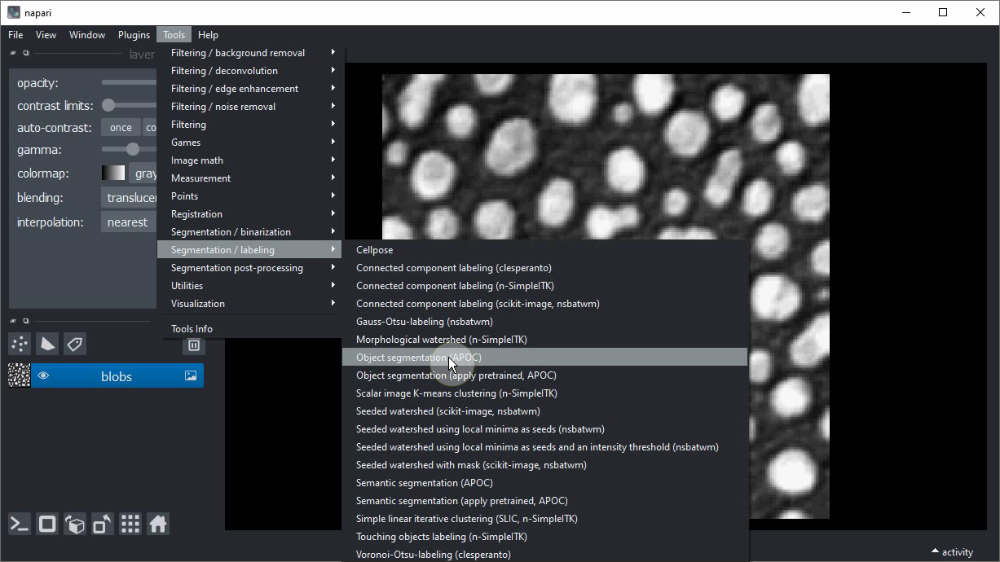
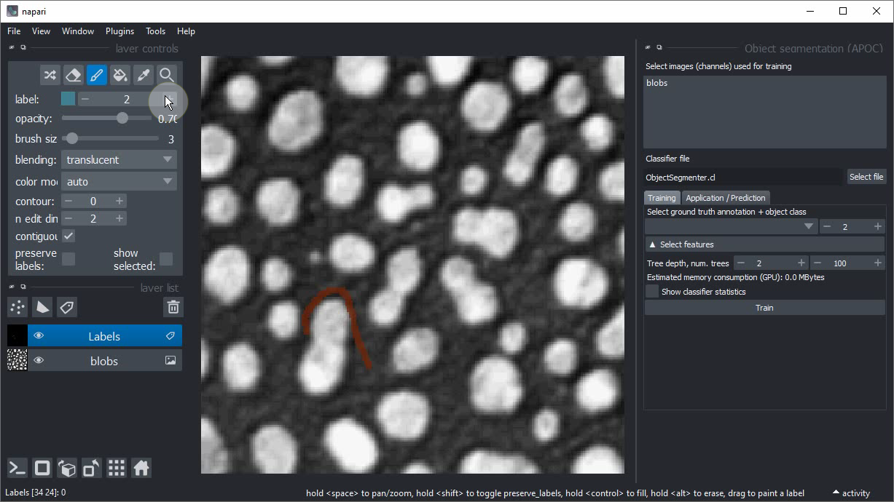

(machine_learning:pixel_classification)=
# Classificação interativa de pixels e segmentação de objetos no Napari

Neste exercício, treinaremos um [Classificador Random Forest](https://en.wikipedia.org/wiki/Random_forest) para classificação de pixels e converteremos o resultado em uma segmentação de instâncias.
Usaremos o plugin do napari [napari-accelerated-pixel-and-object-classification](https://www.napari-hub.org/plugins/napari-accelerated-pixel-and-object-classification).

## Começando

Abra uma janela de terminal e ative seu ambiente conda:

```
conda activate devbio-napari-env
```

Depois, inicie o Napari:

```
napari
```

Carregue o conjunto de dados de exemplo "Blobs" do menu `File > Open Sample > clEsperanto > Blobs (from ImageJ)`


## Classificação de pixels e Segmentação de Objetos no Napari

Para segmentar objetos, podemos usar a ferramenta de Segmentação de Objetos no APOC.
Internamente, ela usa um classificador de pixels e [rotulagem de componentes conectados](https://en.wikipedia.org/wiki/Connected-component_labeling).
O procedimento a seguir também é mostrado [neste vídeo](apoc_object_segmentation.mp4).

Inicie a segmentação de objetos a partir do menu `Tools > Segmentation / Labeling > Object Segmentation (APOC)`.



Adicione uma nova camada de rótulos clicando neste botão:


Mude o tamanho do pincel para um número pequeno como 2 ou 3.


Clique no botão `Paint brush`.


Comece a anotar a região de `fundo` onde não há objeto.


Aumente o rótulo que está sendo desenhado em um.


Desenhe uma anotação dentro dos objetos de interesse. Desenhe anotações de fundo e objeto próximas umas das outras. Quanto mais próximas essas duas anotações forem desenhadas, menor será o grau de liberdade que o computador terá ao otimizar o modelo posteriormente.


Na interface do usuário `Object segmentation` à direita, selecione a imagem/canal que deve ser processado.


Selecione também a imagem de rótulo de anotação que você acabou de desenhar.


Clique em `Train`. Uma imagem rotulada deve aparecer.


Se a segmentação funcionar bem, considere fazer um backup do arquivo `ObjectSegmenter.cl` que foi salvo.
Se você não alterou o local do arquivo antes do treinamento, ele estará localizado na pasta de onde você iniciou o napari na linha de comando.