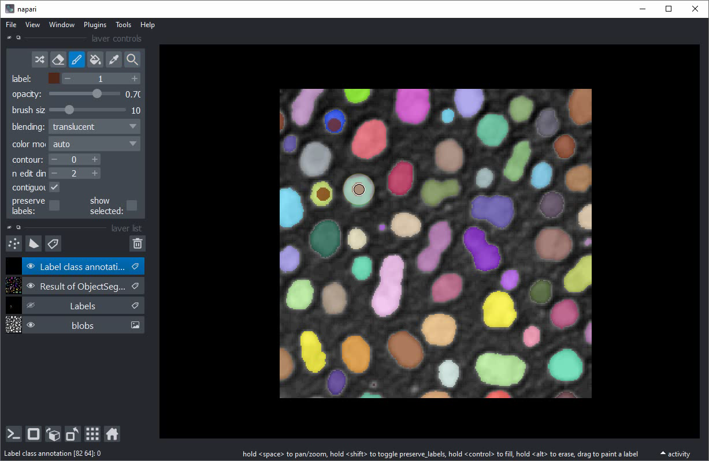
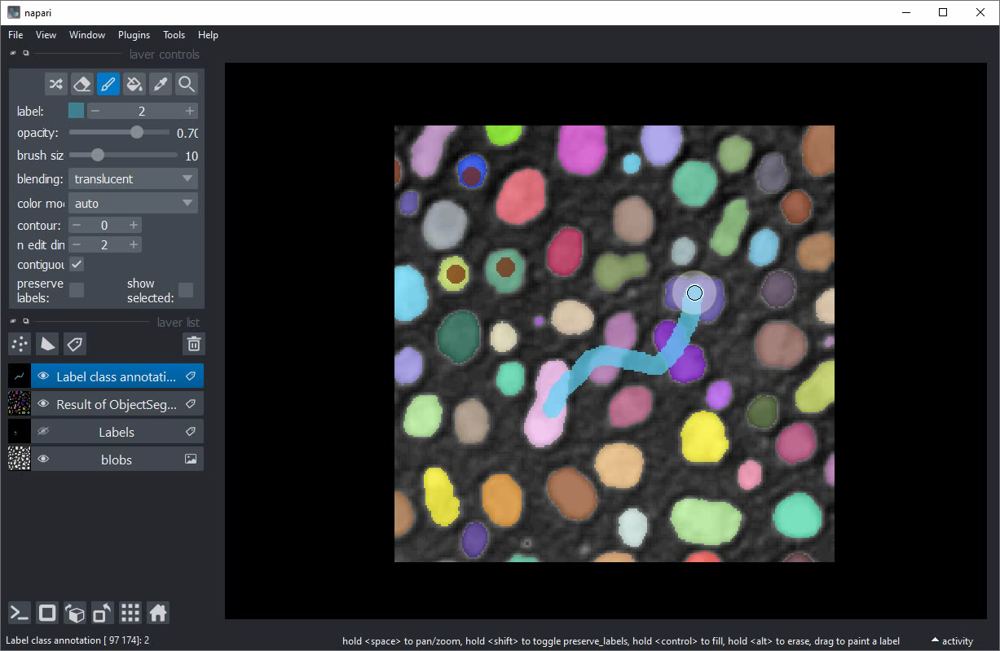
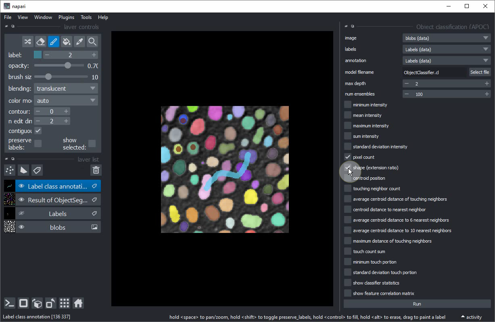

# Classificação interativa de objetos no Napari

Neste exercício, treinaremos [Classificadores Random Forest](https://pt.wikipedia.org/wiki/Random_forest) para classificar objetos segmentados.
Usaremos o plugin do napari [napari-accelerated-pixel-and-object-classification](https://www.napari-hub.org/plugins/napari-accelerated-pixel-and-object-classification).

## Começando

Abra uma janela do terminal e ative seu ambiente conda:

```
conda activate devbio-napari-env
```

Depois, inicie o Napari:

```
napari
```

Carregue o conjunto de dados de exemplo "Blobs" no menu `File > Open Sample > clEsperanto > Blobs (from ImageJ)`

Além disso, precisamos de uma imagem de rótulos. Você pode criá-la usando o [classificador de pixels treinado anteriormente](machine_learning:pixel_classification)
ou usando o menu `Tools > Segmentation / labeling > Gauss-Otsu Labeling (clesperanto)`.

## Classificação de objetos

Nosso ponto de partida é uma imagem carregada e uma imagem de rótulos com objetos segmentados. O procedimento a seguir também é mostrado [neste vídeo](apoc_object_classification.mp4).


Adicione outra imagem de rótulos. Renomeie a imagem de rótulos, por exemplo, para `Label class annotation` para não confundi-la com a outra.


Ative a `Brush tool`.


Coloque pequenos pontos com o rótulo `1` em objetos pequenos e arredondados (para fins de treinamento: realmente apenas os menores).


Aumente o `label` para `2`.


Desenhe uma linha através dos objetos maiores e alongados no centro da imagem.


Inicie a ferramenta de classificação de objetos no menu `Tools > Segmentation post-processing > Object classification (APOC)`


Nesta interface do usuário, ative a caixa de seleção `shape`.


Selecione `image`, `labels` e `annotation` desta forma:


Clique em `Run`. Após um segundo, uma nova camada de rótulos com objetos anotados em marrom/azul deve aparecer. Alguns objetos redondos maiores ficarão azuis involuntariamente.


Oculte a camada de classificação recém-criada.


Selecione sua camada de anotação.


Anote mais alguns objetos arredondados, desta vez os maiores.


Treine o classificador novamente.


Se você estiver satisfeito com o classificador treinado, copie o arquivo para um local seguro. Ao treinar o próximo classificador, este pode ser sobrescrito.

## Exercício extra
Retreine o classificador para que ele possa diferenciar três classes diferentes:
* Objetos pequenos e redondos
* Objetos grandes e redondos
* Objetos grandes e alongados