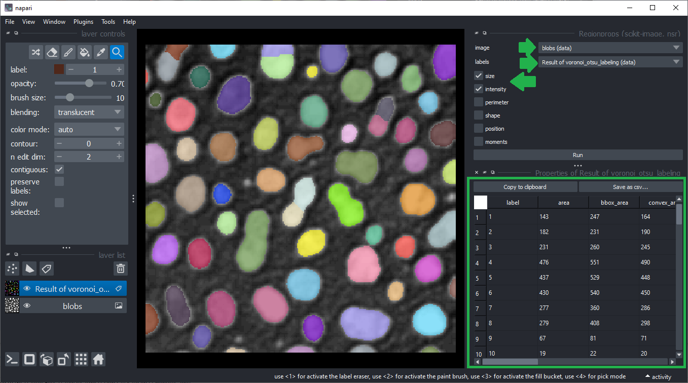
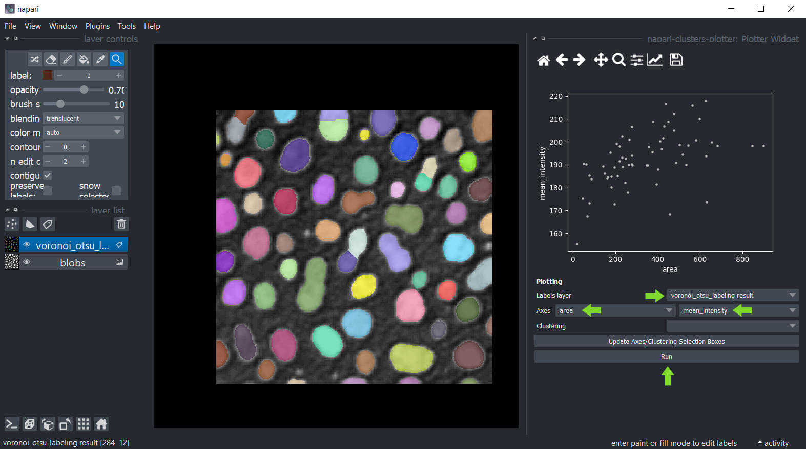
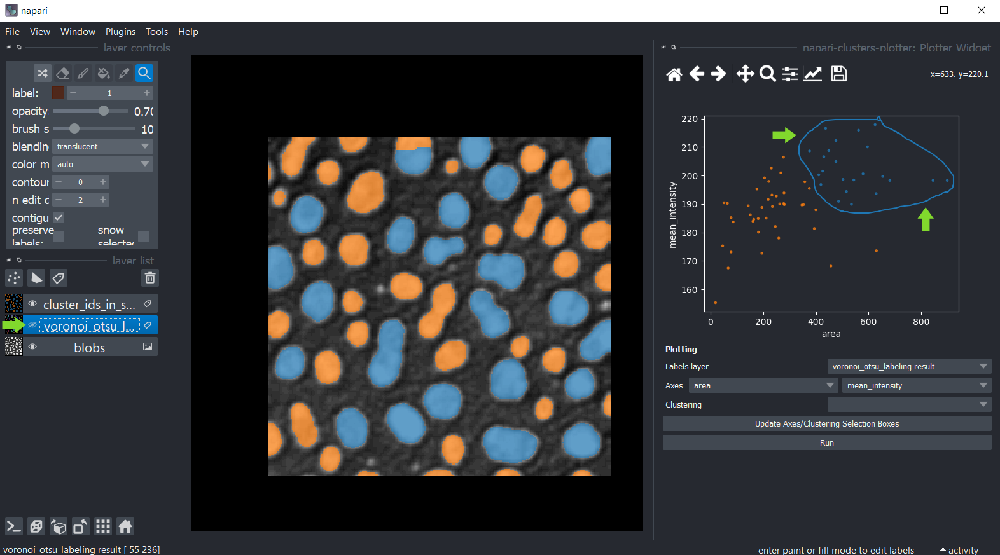
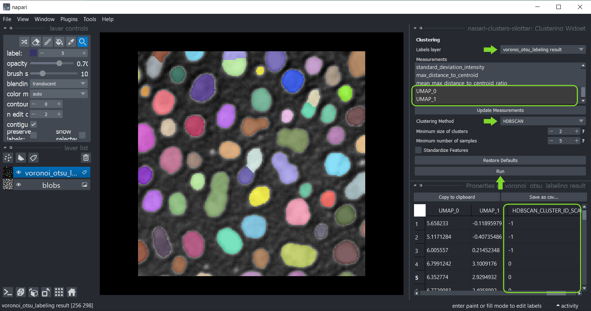

# Redução de dimensionalidade e agrupamento interativos

O [napari-clusters-plotter](https://github.com/BiAPoL/napari-clusters-plotter) oferece ferramentas para realizar vários algoritmos de redução de dimensionalidade e métodos de agrupamento de forma interativa no Napari.

## Começando

Abra uma janela de terminal e ative seu ambiente conda:

```
conda activate devbio-napari-env
```

Depois, inicie o Napari:

```
napari
```

Carregue o conjunto de dados de exemplo "Blobs" do menu `File > Open Sample > clEsperanto > Blobs (from ImageJ)`.
Também precisamos de uma imagem de rótulos. Você pode criá-la usando o menu `Tools > Segmentation / labeling > Gauss-Otsu Labeling (clesperanto)`.

## Ponto de partida
Para agrupar objetos de acordo com suas propriedades, o ponto de partida é uma imagem de intensidade e uma imagem de rótulos
representando uma segmentação de objetos.


## Medições
O primeiro passo é extrair medições da imagem rotulada e dos pixels correspondentes na imagem de intensidade.
Você pode usar o menu `Tools > Measurement > Regionprops (scikit-image, nsr)` para isso.
Basta selecionar a imagem de intensidade, a imagem de rótulos correspondente e as medições `intensity`, `size` e `shape` e clicar em `Run`.
Uma tabela com as medições será aberta:



Depois, você pode salvar e/ou fechar a tabela de medições. Feche também o widget de Medição.

## Plotagem

Uma vez feitas as medições, estas foram salvas nos `features` da camada de rótulos que foi analisada.
Você pode então plotar essas medições usando o menu `Tools > Measurement > Plot measurements (ncp)`.

Neste widget, você pode selecionar a camada de rótulos que foi analisada e as medições que devem ser plotadas
nos eixos X e Y. Se você não conseguir ver opções nas caixas de seleção de eixos, mas realizou medições, clique
em `Update Axes/Clustering Selection Boxes` para atualizá-las. Clique em `Run` para desenhar os pontos de dados na área do gráfico.



Você também pode selecionar manualmente uma região no gráfico. Use o mouse para desenhar um contorno ao redor da região de interesse. 
O agrupamento manual resultante também será visualizado na imagem original. 
Para otimizar a visualização na imagem, desligue a visibilidade da camada de rótulos analisada.



Mantenha pressionada a tecla SHIFT enquanto anota regiões no gráfico para selecionar manualmente vários clusters.


## Redução de dimensionalidade: UMAP, t-SNE ou PCA

Para obter mais insights sobre seus dados, você pode reduzir a dimensionalidade das medições, por exemplo,
usando o [algoritmo UMAP](https://umap-learn.readthedocs.io/en/latest/), [t-SNE](https://scikit-learn.org/stable/modules/generated/sklearn.manifold.TSNE.html)
ou algoritmos [PCA](https://scikit-learn.org/stable/modules/generated/sklearn.decomposition.PCA.html).
Para aplicá-los aos seus dados, use o menu `Tools > Measurement > Dimensionality reduction (ncp)`.
Selecione a imagem de rótulos que foi analisada e na lista abaixo, selecione todas as medições que devem ter sua dimensionalidade reduzida. 
Por padrão, todas as medições são selecionadas na caixa. Se você não conseguir ver nenhuma medição, mas as realizou, clique em `Update Measurements` para atualizar a caixa. 
Você pode ler mais sobre os parâmetros de ambos os algoritmos passando o mouse sobre os pontos de interrogação ou clicando neles. 
Quando terminar a seleção, clique em `Run` e, após um momento, a tabela de medições reaparecerá com duas colunas adicionais representando as dimensões reduzidas do conjunto de dados. 
Essas colunas são automaticamente salvas nos `features` da camada de rótulos.


Depois, você pode novamente salvar e/ou fechar a tabela. Feche também o widget de Redução de Dimensionalidade.

## Agrupamento

Se os pontos de dados estiverem claramente separados, o agrupamento automático pode ser uma opção, usando estes algoritmos implementados:
* [Agrupamento k-means (KMEANS)](https://towardsdatascience.com/k-means-clustering-algorithm-applications-evaluation-methods-and-drawbacks-aa03e644b48a)
* [Agrupamento Espacial Baseado em Densidade Hierárquica de Aplicações com Ruído (HDBSCAN)](https://hdbscan.readthedocs.io/en/latest/how_hdbscan_works.html)
* [Modelo de Mistura Gaussiana (GMM)](https://scikit-learn.org/stable/modules/mixture.html)
* [Mean Shift (MS)](https://scikit-learn.org/stable/auto_examples/cluster/plot_mean_shift.html#sphx-glr-auto-examples-cluster-plot-mean-shift-py)
* [Agrupamento Aglomerativo (AC)](https://scikit-learn.org/stable/modules/generated/sklearn.cluster.AgglomerativeClustering.html)

Portanto, clique no menu `Tools > Measurement > Clustering (ncp)` e selecione a camada de rótulos analisada.
Desta vez, selecione as medições para agrupamento, por exemplo, selecione _apenas_ as medições `UMAP`.
Selecione o método de agrupamento `KMeans` e clique em `Run`.
A tabela de medições reaparecerá com uma coluna adicional `KMeans_CLUSTERING_ID` contendo o ID do cluster de cada ponto de dados.



Depois, você pode novamente salvar e/ou fechar a tabela. Feche também o widget de agrupamento.

## Plotando resultados do agrupamento
Retorne ao widget Plotter usando o menu `Tools > Measurement > Plot measurements (ncp)`.
Selecione `UMAP_0` e `UMAP_1` como eixos X e Y e o `KMeans_CLUSTERING_ID` como `Clustering`, e clique em `Run`.

