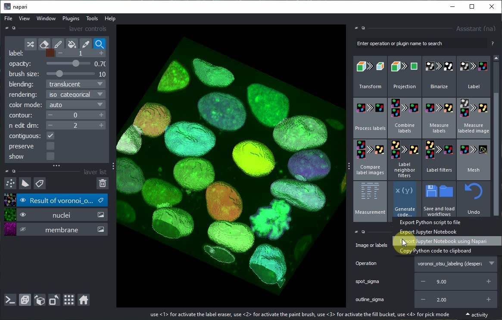
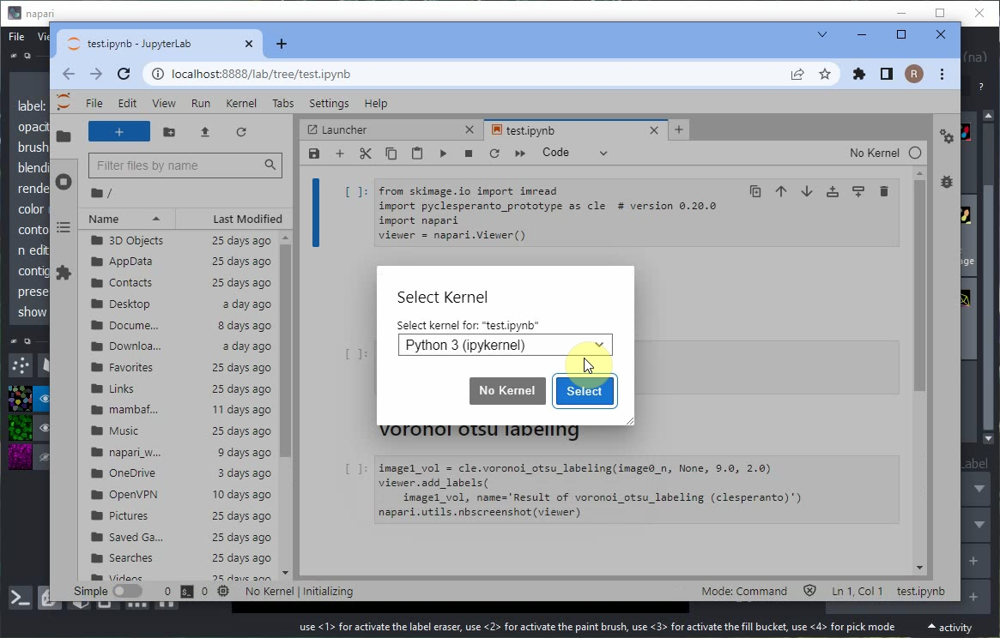

# Gerando Notebooks Jupyter a partir do Napari Assistant

Depois de configurar um fluxo de trabalho usando o Napari Assistant, podemos exportar o código Python, por exemplo, como um Notebook Jupyter.

Este tutorial também está disponível em vídeo [export_notebooks.mp4](images/export_notebooks.mp4)

No painel do Assistant, clique no botão `Generate Code...` e no menu `Export Jupyter Notebook using Napari`.



O Jupyter lab será aberto e pedirá para você selecionar um Kernel. Mantenha a opção padrão e clique em `Select`.



Ao executar o notebook, podem aparecer erros, por exemplo, ao carregar os dados.


Role para baixo até o final da mensagem de erro para ler o que não funcionou.


Role para cima novamente até a célula do notebook que não funcionou e modifique o código para que ele use a função `imread` para carregar a imagem do disco.


Caso você ainda não tenha a imagem `nuclei` salva no disco, use o menu `File > Save current Layer(s)` para salvar a camada `nuclei` como arquivo `.tif`.


Depois disso, execute novamente o notebook e inspecione o resultado. O visualizador Napari que foi aberto em segundo plano também será mostrado dentro do notebook.


Se você também quiser visualizar os dados brutos da imagem junto com o resultado da segmentação, adicione estas linhas ao seu código:

```python
viewer.add_image(image0_n)
napari.utils.nbscreenshot(viewer)
```


Execute novamente o notebook, ou modifique manualmente a ordem das camadas no visualizador Napari. No final, deve ficar assim.


Pronto! Você agora gerou um Notebook Jupyter a partir de um fluxo de trabalho do Napari Assistant. Este notebook documenta seu trabalho de forma reproduzível e pode ser compartilhado com outras pessoas.